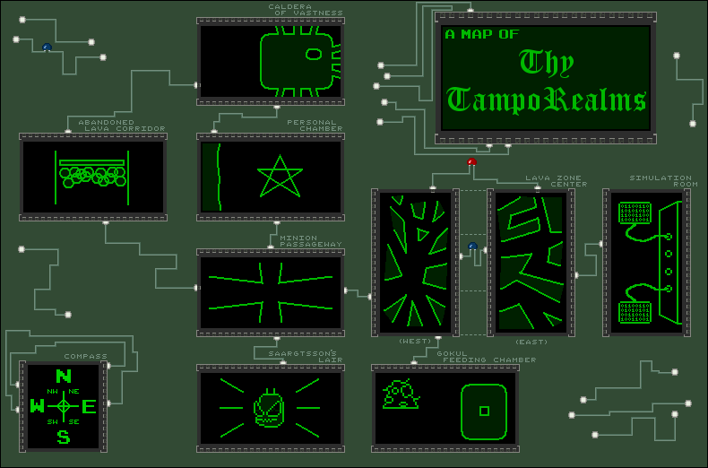

To celeberate the tenth-ish anniversary of [Thy TampoBrain XVII](http://fanstuff.clamburger.org/tampobrain/), I'm releasing the source code for all to see. Couldn't find the Gokul Feeding Chamber? Unable to get through the shortcut? Confused by the virus puzzles? Your worries end today!

What is Thy Tampobrain XVII?
==

**Thy TampoBrain XVII** is a text adventure, created using the same Flash-based framework used for [Thy Dungeonman 3](http://www.homestarrunner.com/dman3.html) (from the creators of Homestar Runner). It was released in 2006 and can best be described as "interactive fan fiction", as it focuses on [incredibly minor characters](http://www.hrwiki.org/wiki/Stinkoman_20X6_Enemies_and_Items) from the Homestar Runner universe.

The writing is a little bit cringeworthy, and the few graphics the game has are less than stellar. It's my estimation that no more than 20 people ever played the game. Nonetheless, those people had a lot of fun playing it and I had a lot of fun coding it, so it will forever have a soft spot in my heart.

For more info on Thy TampoBrain XVII, check out the [wiki page](http://fanstuff.hrwiki.org/wiki/Thy_TampoBrain_XVII). Huge thanks to **Joshua**, without whom there would not be a game at all.

Using the source code
==

Okay, I lied a bit. Not all of the source code is available, and certainly nothing that you compile into a working game. Unfortunately, the complete source code (particularly the .fla file) contains several assets from the original Thy Dungeonman 3 game, so I've had to omit those for copyright reasons. But don't worry, you're not missing much though: all the good stuff is right here in the ActionScript files.

How things work
==

When you enter a command, this is how it gets parsed (barring any special cases):

1. The code for the room you're in checks if it can action your command.
2. If not, the generic room ([Room.as](Room.as)) file checks if it can action your command.
3. If there's still no luck, control passes to the fallback file ([DontUnderstand.as](DontUnderstand.as)), which usually just tells you that your command was bad.

In all cases, `_loc2` in the code refers to the command you entered, and `this.put` is the text the appears.

A command will often check or set a `GameState` variable. You can find a list of these (along with descriptions of what they mean) in [GameState.as](GameState.as)

Synonyms
===

Each room file, as well as the base Room class, defines a list of synonyms. All synonyms within a set act identically: for example, `talk` and `speak` are synonyms, so entering `talk brody` and `speak brody` will have the same result.

Locations
===

Here's a rough map of the game:

Here's how this map matches up to the game files:
 
* [Room_center_east.as](Room_center_east.as) - Lava Zone Center (East)
* [Room_center_west.as](Room_center_west.as) - Lava Zone Center (West)
* [Room_corridor_north.as](Room_corridor_north.as) - Abandoned Lava Corridor (when accessed via the Caldera of Vastness)
* [Room_corridor_south.as](Room_corridor_south.as) - Abandoned Lava Corridor (when accessed via the Minion Passageway)
* [Room_crossroads.as](Room_crossroads.as) - Minion Passageway
* [Room_end_game.as](Room_end_game.as) - a "cutscene" of sort that activates after finishing all three virus puzzle areas. The final battle minigame starts after the cutscene.
 * [FlaskGame.as](FlaskGame.as) - the code that controls the final battle minigame
* [Room_gokul.as](Room_gokul.as) - Gokul Feeding Chamber
* [Room_lavalake.as](Room_lavalake.as) - Caldera of Vastness
* [Room_puzzle_brody.as](Room_puzzle_brody.as) - Second virus puzzle area
* [Room_puzzle_stlunko.as](Room_puzzle_stlunko.as) - Third virus puzzle area
* [Room_puzzle_tampo.as](Room_puzzle_tampo.as) - First virus puzzle area (automatically entered once you exit the Secret Laboratory with the anti-viral hardware)
* [Room_secret_lab.as](Room_secret_lab.as) - Secret Laboratory (accessed via Caldera of Vastness)
* [Room_shortcut.as](Room_shortuct.as) - Secret path between the two Lava Zone Center rooms
* [Room_simulate.as](Room_simulate.as) - Simulation Room
* [Room_snake.as](Room_snake.as) - Saargtsson's Lair
* [Room_spikes.as](Room_spikes.as) - Personal Chamber
* [Room_virtual.as](Room_virtual.as) - accessed when you use the headset in the simulation Room)
